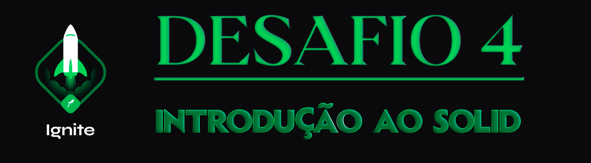

  

<h1 align="center"> RocketSeat 🚀 Ignite NodeJS 🌠</h1>

  
  
  
  

## 🧠 Detalhes do desafio

Nesse desafio, você deverá criar uma aplicação para treinar o que aprendeu até agora no Node.js!

Essa será uma aplicação de listagem e cadastro de usuários. 

Para que a listagem de usuários funcione, o usuário que solicita a listagem deve ser um admin (mais detalhes ao longo da descrição).

  

Feito com ❤️ por [Augusto Hermes](https://github.com/augustohermes) 👋.
